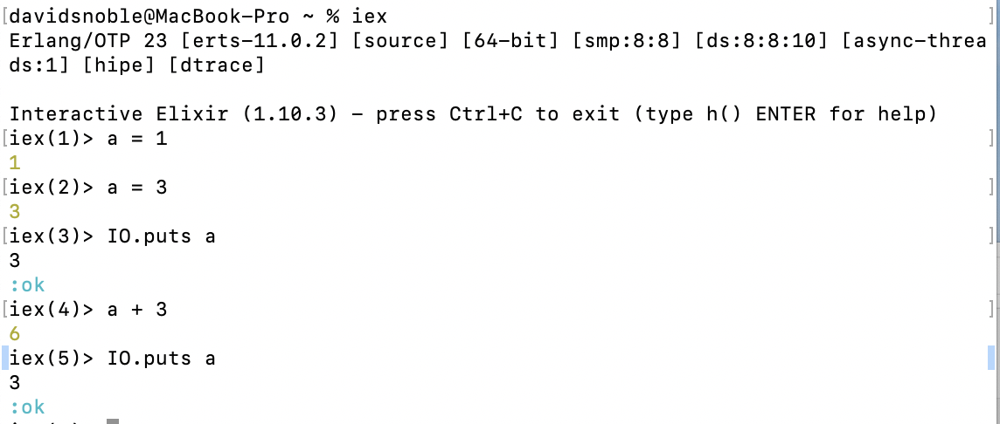

## Immuntability
- Immuntability does not allow values to change in memory.
- This allows multiple processes to accsess the same value without it changing throughout your programs life span
- In elixir we are allowed to rebind variables which means we can give through away the reference to the old variable and assign it a new value 

