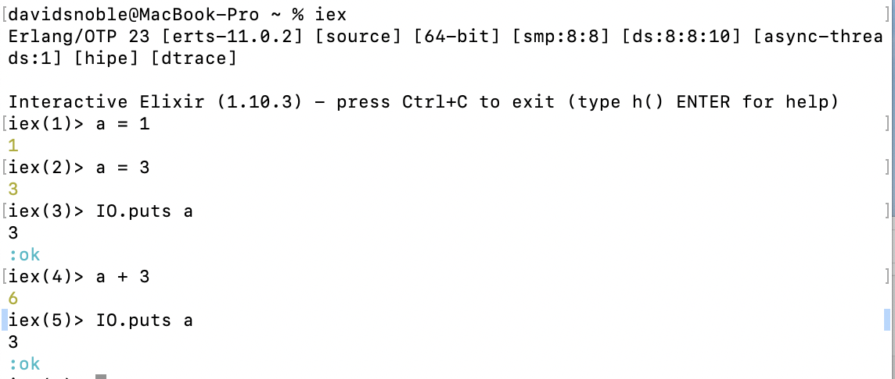

## Processes & Concurrency 
- Elixir has what is called Processes which can be summed up as seperate actions which can send and recieve messsages between each other.
- Elixir can run thousands of processes **Concurrently** which means that they run at the same time seperate from each other process
- Elixir Processes can be acessed through their own PID(Process ID)

---
We will show an example of a process here do not worry to much about the syntax for now. We will create a process that waits until we receive a message and outputs that message.


---

###Concurrent module example
Here we will make another example program with an elixir script that does the same thing from the terminal

```elixir
defmodule Pros do
  def start do
    IO.puts "{__MODULE__} at your service"
    loop()
  end
  def loop do
    receive do
      msg -> IO.puts msg
    end
    loop()
  end
end

pid = spawn(Pros, :start, [])
send(pid, "This is my first message")
send(pid, "This is my new message")
```


---

## Immuntability
- Immuntability does not allow values to change in memory.
- This allows multiple processes to accsess the same value without it changing throughout your programs life span
- In elixir we are allowed to rebind variables which means we can give through away the reference to the old variable and assign it a new value 


